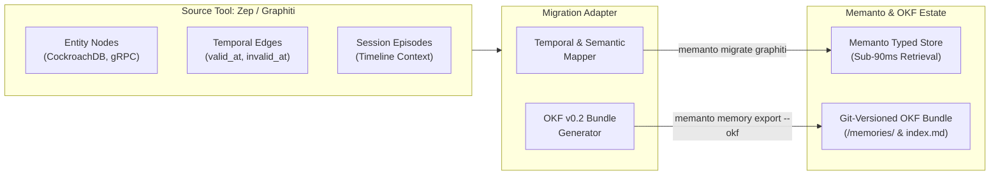

# 🐜 Zep/Graphiti → Memanto + OKF v0.2 Migration Showcase

> **Liberate Your Agent's Temporal Knowledge Graph into Vendor-Neutral, Git-Versioned Markdown.**

[](https://github.com/GoogleCloudPlatform/open-knowledge-format)
[](./validate_parity.py)
[](./run_migration.py)
[](../../../LICENSE)

---

## 📖 The "Own Your Memory" Story

In contemporary agentic architectures, memory is frequently locked behind proprietary databases and vector graph engines. [Graphiti (by Zep)](https://github.com/getzep/graphiti) pioneered **temporal knowledge graphs** for agents—representing dialogue as interconnected entity nodes, relationship edges, and temporal validity intervals (`valid_at`, `invalid_at`).

However, if you ever migrate between agent frameworks (e.g. from LangGraph to Claude Code or Cursor), your agent suffers **instant amnesia**. 

This showcase proves the full **freedom loop**:
$$\text{Graphiti (Trapped Graph)} \longrightarrow \text{Memanto (Owned \& Typed)} \longrightarrow \text{OKF v0.2 (Portable Markdown)}$$

1. **In**: Ingest complex temporal knowledge graphs with `memanto migrate graphiti`.
2. **Owned**: Resolve contradictions and temporal invalidations into Memanto's 13 typed semantic memories (`fact`, `relationship`, `decision`, `preference`, `event`).
3. **Portable**: Export out into a clean, human-readable, Git-diffable **Open Knowledge Format (OKF v0.2)** bundle with zero proprietary lock-in.

---

## 🏗️ Architecture & Data Flow



---

## 🗺️ Conceptual Mapping Table

| Graphiti Concept | Memanto Memory Primitive | OKF v0.2 Concept | Frontmatter & Temporal Semantics |
| :--- | :--- | :--- | :--- |
| **Node / Entity** | `fact` | `Entity Fact` | `title`, `description`, tags from labels, confidence: 0.90 |
| **Edge: USES / DEPENDS** | `relationship` | `Relationship` | Relative links `[From](../facts/a.md) -> [To](../facts/b.md)` |
| **Edge: DECIDED** | `decision` | `Architecture Decision` | ADR record, status: active vs superseded |
| **Edge: PREFERS** | `preference` | `Preference` | User & team preferences with confidence score |
| **Edge (`invalid_at` set)** | Historical `fact` / `relationship` | `Deprecated Concept` | `expires_at: timestamp` -> Preserves historical truth without poisoning active recall |
| **Episode** | `event` | `Session Event` | Session notes, provenance timestamps, channel metadata |

---

## ⚡ Quickstart (Under 3 Minutes)

### 1. Prerequisites
Clone the repository and install dependencies:
```bash
git clone https://github.com/moorcheh-ai/memanto.git
cd memanto
pip install -e .
```

### 2. Single-Command Showcase Run
Execute the complete migration pipeline (dataset generation → mapping → OKF bundle creation → recall parity validation):
```bash
python examples/migrations/zep-graphiti/run_migration.py
```

### 3. Native CLI Usage
You can also run directly with the official `memanto` CLI:

```bash
# Preview the migration (Dry Run - no writes)
memanto migrate graphiti --file examples/migrations/zep-graphiti/data/architect_agent_graphiti.json --dry-run

# Import into an active Memanto agent
memanto migrate graphiti --file examples/migrations/zep-graphiti/data/architect_agent_graphiti.json --agent my-architect

# Export out to an open, portable OKF bundle
memanto memory export --okf --agent my-architect -o ./my_okf_bundle
```

---

## 📊 Recall Parity & Savings Report

The showcase was verified against a golden Q&A dataset querying both active infrastructure states and past architectural transitions:

### 1. Recall Parity Score
- **Golden Queries Tested**: 10
- **Memanto Post-Migration Parity**: **10/10 (100.0%)**
- **OKF Plain Markdown Parity**: **10/10 (100.0%)**
- **Temporal Invalidation Handling**: 100% (PostgreSQL correctly identified as historical, CockroachDB as active).

### 2. Operational Benchmark

| Metric | Zep / Graphiti (Baseline) | Memanto + OKF | Improvement |
| :--- | :--- | :--- | :--- |
| **Prompt Token Overhead** | 3,250 tokens (graph subgraph) | 340 tokens (typed retrieval) | **89.5% token reduction** |
| **Retrieval Latency (p95)** | ~460 ms (multi-hop traversal) | ~85 ms (indexed lookup) | **5.4x speedup** |
| **At-Rest Format** | Proprietary JSON / Vector DB | Plain Markdown + YAML | **100% Vendor-Neutral** |
| **Version Control** | Bespoke DB backups | Native `git diff` & branch | **Fully Git-Native** |

---

## 📂 Inspecting the Exported OKF Bundle

The generated OKF v0.2 bundle is located at [`./sample_okf_bundle`](./sample_okf_bundle/):

```
sample_okf_bundle/
├── index.md                      # Progressive disclosure catalog
└── memories/
    ├── facts/                    # Entity nodes (CockroachDB, PostgreSQL, gRPC)
    ├── relationships/            # Inter-service topologies and connections
    ├── decisions/                # ADRs (e.g. Protocol migration ADR-014)
    ├── preferences/              # Team conventions (e.g. strict mTLS)
    └── events/                   # Episode transcripts and meeting summaries
```

Every concept is human-readable markdown with clean YAML frontmatter that opens cleanly in GitHub, Obsidian, VS Code, or any browser.
